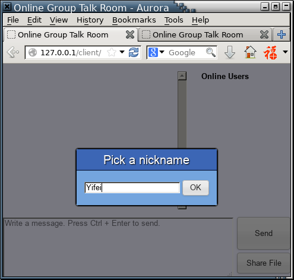
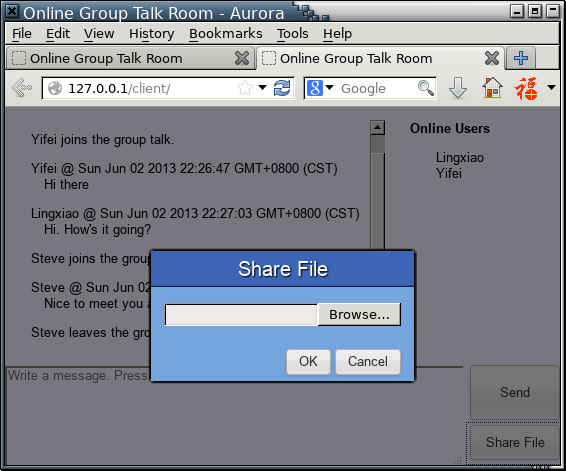
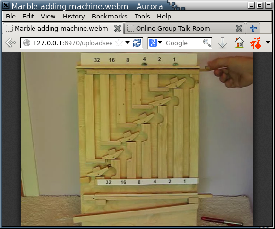

基于HTML5 WebSocket的在线群聊
===========================

## 介绍

HTML5中引入了WebSocket，实现了客户端与服务器端的直接双向通信。WebSocket的实现遵循RFC 6455规定，包括HTTP握手、数据打包和状态控制等具体协议。在服务器端的配合下，可以实现浏览器中非常便利的双向数据转发，并进而实现群聊与文件传输的功能。

客户端的表现形式是网页文件（HTML），可以在服务器端静态存储。用户打开这个网页文件后，用户的浏览器与服务器通过一次HTTP握手建立WebSocket连接，之后则以TCP连接的形式发送数据包，不再需要HTTP协议。

服务器端处理握手HTTP报文，并返回适当的HTTP响应，随后则是TCP交流，实现由Node.js完成。

## 使用与功能介绍

0.  必要配置

    本机需要运行apache或其他静态资源服务器，以及Node.js，并安装扩展包socket.io（`npm install -g socket.io`）。同时客户端需要安装现代浏览器。

1.  启动服务器

    执行`node ./server/server.js`，即启动服务器，在整个过程中控制台不会再有提示。

    进入`server`文件夹，创建`upload`文件夹，此文件夹用来托管用户上传的内容。

2.  访问网页应用

    将`client`文件夹拷贝至服务器托管区域，从浏览器访问文件夹中`index.html`，如`http://127.0.0.1/client/index.html`。

    首先需要输入昵称。

    

    点击OK后进入聊天窗口。右上方为当前在线用户，在昵称上悬浮可以看到其临时服务器ID。左上方为消息框，显示聊天内容及系统通知。左下方为输入框，右下方有发送消息按钮与文件共享按钮。

    

    系统通知包括其他用户的加入与退出，以及文件共享。

3.  文件共享

    点击右下方Share File按钮后，弹出提示框，需要选择本地文件并点击OK，如下所示。

    

    上传成功后，系统对所有用户广播此文件，并以超链接的形式提供下载。

    

    服务器同时提供文件的MIME类型，方便浏览器直接打开。如图中所示为webm格式的视频文件，HTTP请求返回`Content-Type: video/webm`，使之能够在浏览器中直接播放。

    

## 源码文件列表

    ---- web-socket-chat
       |
       +--- README.md    Github repo说明
       |
       +--- REPORT.md    实验报告
       |
       +--- assets   实验报告外链图片
       |
       +--- server
       |  |
       |  +--- server.js    服务器端程序
       |  |
       |  +--- server.js.old    废弃的服务器端程序，能够实现RFC 6455规定WebSocket协议的HTTP握手
       |  |
       |  +--- upload    上传文件托管区域
       |
       ---- client
          |
          +--- index.html    HTML文件
          |
          +--- yui.css    引用自YUI 3，包括CSS Reset，基本样式，字体设置与按钮样式
          |
          +--- yui.js    引用自YUI 3，包括YUI Core, node, event, button等
          |
          +--- style.css    页面布局与样式设置
          |
          +--- main.js    客户端主要功能
          |
          ---- socket.io    socket.io客户端库
