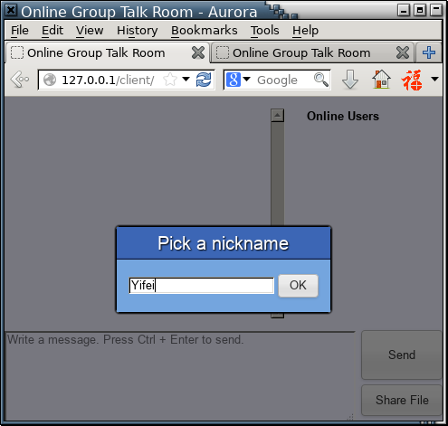
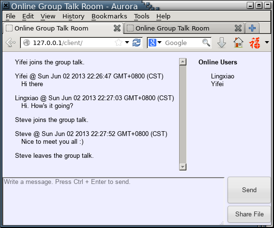
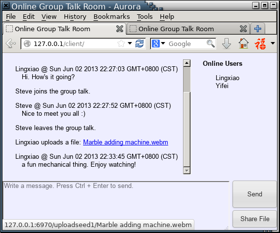
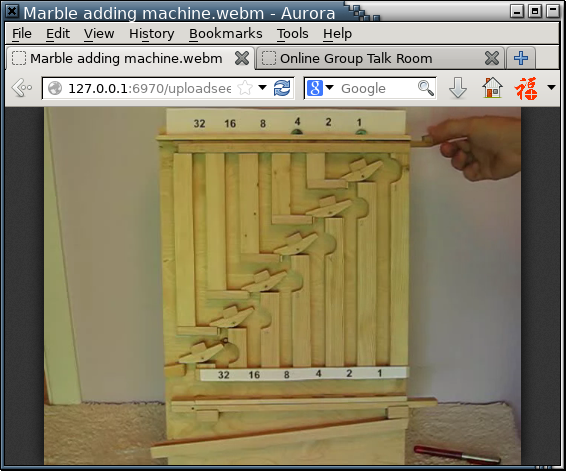

% title 基于HTML5 WebSocket的在线群聊
% authors 杨令潇(PB10000316)  张义飞(PB10007)

# 介绍

HTML5中引入了WebSocket，实现了客户端与服务器端的直接双向通信。WebSocket的实现遵循RFC 6455规定[^1]，包括HTTP握手、数据打包和状态控制等具体协议。在服务器端的配合下，可以实现浏览器中非常便利的双向数据转发，并进而实现群聊与文件传输的功能。

[^1]: RFC 6455 - The WebSocket Protocol: <http://tools.ietf.org/html/rfc6455>

客户端的表现形式是网页文件（HTML），可以在服务器端静态存储。用户打开这个网页文件后，用户的浏览器与服务器通过一次HTTP握手建立WebSocket连接，之后则以TCP连接的形式发送数据包，不再需要HTTP协议。

服务器端处理握手HTTP报文，并返回适当的HTTP响应，随后则是TCP交流，实现由Node.js完成。

# 使用与功能介绍

0.  必要配置

    本机需要运行apache或其他静态资源服务器，以及Node.js，并安装扩展包socket.io（`npm install -g socket.io`）。同时客户端需要安装现代浏览器。

1.  启动服务器

    执行`node ./server/server.js`，即启动服务器，在整个过程中控制台不会再有提示。

    进入`server`文件夹，创建`upload`文件夹，此文件夹用来托管用户上传的内容。

2.  访问网页应用

    将`client`文件夹拷贝至服务器托管区域，从浏览器访问文件夹中`index.html`，如`http://127.0.0.1/client/index.html`。

    首先需要输入昵称。

    

    点击OK后进入聊天窗口。右上方为当前在线用户，在昵称上悬浮可以看到其临时服务器ID。左上方为消息框，显示聊天内容及系统通知。左下方为输入框，右下方有发送消息按钮与文件共享按钮。

    

    系统通知包括其他用户的加入与退出，以及文件共享。

3.  文件共享

    点击右下方Share File按钮后，弹出提示框，需要选择本地文件并点击OK，如下所示。

    

    上传成功后，系统对所有用户广播此文件，并以超链接的形式提供下载。

    

    服务器同时提供文件的MIME类型，方便浏览器直接打开。如图中所示为webm格式的视频文件，HTTP请求返回`Content-Type: video/webm`，使之能够在浏览器中直接播放。

    

# 原理

## RFC 6455: WebSocket协议规范

## WebSocket统一协议：socket.io

开源项目socket.io针对不同浏览器的新旧技术，搭建了一套统一的Socket协议。现代浏览器通过WebSocket协议工作，旧的浏览器能够通过Ajax实现同样的功能。如果浏览器支持Flash，也能够通过此插件与服务器建立连接。客户端与服务器端的Socket均由事件驱动，每一方可向对方发送事件（`socket.emit`），同时可监听收到的所有事件（`socket.on`）。发送事件的同时，可以附带JSON类型的数据，其大小不受限制。

服务器端的控制顺序为：

1.  `io.sockets.listen(PORT)`

    PORT是socket.io占用的端口，任何一个用户端向这个端口发起socket.io通信，即可被捕捉到。

2.  `io.sockets.on('connection', callback)`

    如前文所述，通过HTTP握手协议后，触发connection事件，同时新增一对用户端与服务器端的独立socket，作为回调函数的参数传入callback。

3.  `socket.on('my-event', callback)`与`socket.emit('my-event', message)`

    on方法是监听事件，emit方法是向这个socket发送事件。同时`io.sockets.emit`方法可以对所有连接到服务器的socket发送事件，起到广播的作用。

4.  `socket.on('disconnect', callback)`

    每一对socket不断发送心跳信号（heartbeat signal），一旦连接断开，如用户关闭浏览器窗口，会引发心跳信号的停止，进而引起disconnect事件。

客户端的控制顺序为：

1.  `socket = io.connect('http://127.0.0.1:6969')`

    客户端主动建立连接，并指定服务器IP与端口号。

2.  `socket.on('my-event', callback)`与`socket.emit('my-event', message)`

    类似服务器端，on方法是监听事件，emit方法是发送事件。只不过客户端仅能与服务器进行通信。

## 文件上传API与base64编码

浏览器通常通过`<input type="file">`输入框来获得对用户文件的访问权限。点击这个输入框，弹出选择文件的窗口。选择后浏览器即可访问这个文件。

HTML中定义的File API提供了几个接口：文件名称、文件大小与文件MIME类型等，例子如下。

HTML:

    <input type="file" id="choose-file">

Javascript:

    var el = document.getElementById('choose-file');
    el.addEventListener('change', function (e) {
        var files = e.target.files;  //e.target与el等价
        var f = files[0];
        console.log(f.name);  //真实文件名
        console.log(f.size);  //字节数
        console.log(f.type);  //MimeType
    }, false);

获得文件的`File`对象之后，还可以用`FileReader`对象获得文件的内容，在此处仅使用`readAsDataURL`方法。

Javascript:

    var r = new FileReader;
    r.onload = function (e) {
        console.log(e.target.result);  //e.target与r等价
    };
    r.readAsDataURL(f);  //f是上面的File对象

Data URL是以base64编码表示文件内容的字符串，如对于一个短文件，其Data URL为：

`data:application/zip;base64,UEsDBBQAAAAAjgAAAG91dHB1dDAxLnR4dFBLBQYAAAAABAAEAOYAAAC/AAAAAAA=`

`base64,`之后的字符即为文件内容的base64编码。编码后不含特殊字符，可以安全传送到服务器并解码至二进制缓冲区（Binary buffer），最后写入文件。

# 技术实现

## Socket通信

建立在socket.io之上，我们仅需考虑客户端与服务器端事件的安排。下表中列出了两个方向上所有事件的意义，大致按时间排序，其中&uarr;表示客户端到服务器端，&darr;表示服务器端到客户端。

+-------+------------------+-------------------------------+
|通信方向     事件名称            功能描述                     |
+=======+==================+===============================+
| &uarr;| connection       |建立连接（socket.io内置）        |
+-------+------------------+-------------------------------+
| &darr;|  hello           |向客户端发送其ID号码              |
+-------+------------------+-------------------------------+
|&uarr; |register-nickname |在服务器注册昵称，与ID相联系       |
+-------+------------------+-------------------------------+
|&darr; |message           |广播消息字符串（如上线、下线）     |
+-------+------------------+-------------------------------+
|&darr; |online-update     |广播在线用户名单                 |
+-------+------------------+-------------------------------+
|&uarr; |client-send       |向服务器发送文字消息              |
+-------+------------------+-------------------------------+
|&darr; |server-ack        |广播最新消息内容与发送者等         |
+-------+------------------+-------------------------------+
|&uarr; |send-file         |将文件内容经base64编码后传送至服务器|
+-------+------------------+-------------------------------+
|&darr; |msg-file          |广播文件上传者、文件名与下载地址    |
+-------+------------------+-------------------------------+
|&uarr; |disconnect        |断开连接（socket.io内置）        |
+-------+------------------+-------------------------------+

## 文件上传与下载

如前所述，文件从客户端上传到服务器可通过base64编码实现。服务器收到base64编码之后，解码至二进制文件，并写入`upload`文件夹下的文件，文件名取为服务器产生的唯一数字编号，如`upload/1`，`upload/2`等。

获取文件通过向服务器发送类似`http://127.0.0.1:6970/uploadseed1/Marble%20adding%20machine.webm`的URL请求。实际上，这不是服务器托管文件的真实路径，而是为了方便用户按原文件名存储产生的虚拟路径。这个虚拟路径中，真实文件编号写在`uploadseed`之后的数字中，服务器监听6970端口，从HTTP请求中抓取URL，将编号为1的文件内容写入HTTP响应。

同时在用户上传文件时，服务器维护每一个文件编号的MIME类型，以便在用户下载时将其写入HTTP响应头部。

## 客户端界面控制

网页文件采用YUI 3作为开发框架，包括CSS重置、DOM基础操作与事件捕捉。同时也包含模板填充，如：

Javascript:

    var template = '
{user} uploads a file: <a href="{href}">{name}</a>
';
    var message = {
        user: 'Lingxiao',
        href: 'fakepath',
        name: 'robots.txt'
    }
    Y.Lang.sub(template, message);
    // <= '
Lingxiao uploads a file: <a href="fakepath">robots.txt</a>
'

# 源码文件列表

    ---- web-socket-chat
       |
       +--- README.md    Github repo说明
       |
       +--- REPORT.md    实验报告
       |
       +--- assets   实验报告外链图片
       |
       +--- server
       |  |
       |  +--- server.js    服务器端程序
       |  |
       |  +--- server.js.old    废弃的服务器端程序[^2]
       |  |
       |  +--- upload    上传文件托管区域
       |
       ---- client
          |
          +--- index.html    HTML文件
          |
          +--- yui.css    YUI 3 Library[^3]
          |
          +--- yui.js    YUI 3 Library[^4]
          |
          +--- style.css    页面布局与样式设置
          |
          +--- main.js    客户端主要功能
          |
          ---- socket.io    socket.io客户端库

[^2]: 能够实现RFC 6455规定中WebSocket协议的HTTP握手，但是不能够解析WebSocket数据包。
[^3]: 集合了CSS Reset，CSS Base，CSS Font与YUI Style Button。
[^4]: 集合了YUI Core, node, event, button模块等。